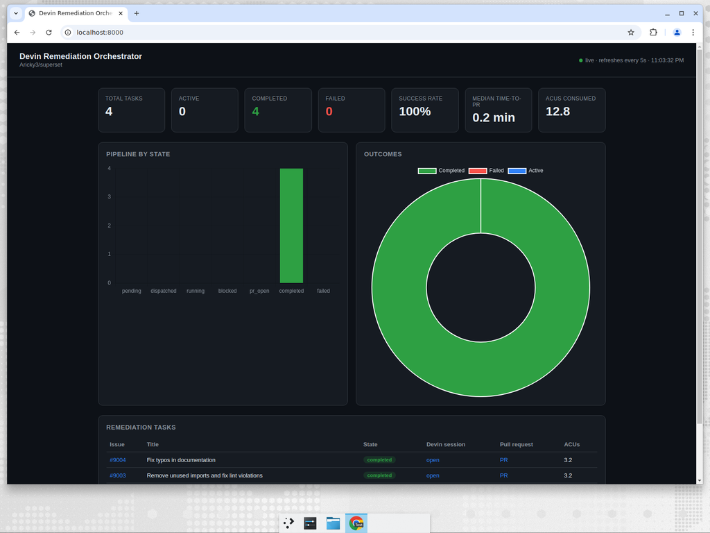

# Devin Remediation Orchestrator

**An event-driven automation that turns a GitHub issue backlog into merged fixes — autonomously — using the [Devin API](https://docs.devin.ai/api-reference/overview) (v3 organization sessions) as the execution primitive.**

> Label an issue `devin-remediate` → the orchestrator spins up a Devin session → Devin investigates the repo, writes a minimal fix, and opens a PR that closes the issue → a live dashboard shows an engineering leader exactly what's working, how fast, and at what cost.



---

## 1. The problem this solves

Every engineering org has a long tail of **well-understood but never-prioritized work**: security findings from scanners, dependency upgrades, lint/type debt, deprecation cleanups, doc rot. Each item is individually small, collectively enormous, and chronically starved of engineer time.

This system treats that backlog as an **event stream** and attaches an autonomous engineer (Devin) to it. The moment an issue is triaged for remediation (a label, a webhook, a scan result, a schedule), Devin is dispatched to actually fix it and open a reviewable PR — no human in the loop until code review.

## 2. Why Devin is the core primitive (not just a helper)

A traditional automation here would be a brittle script: regex-replace a string, bump a pin, run codemod. That breaks the instant the fix requires *judgement* — reading surrounding code, preserving behavior, following repo conventions, writing a sensible PR description.

Devin is used here as a **general-purpose remediation worker**: each task is a fresh autonomous session given an issue and a repo, and it decides *how* to fix it. The orchestrator never edits code — it only **dispatches, tracks, and reports**. That separation is the whole point: the hard part (writing correct, context-aware changes across a 600k-LOC codebase like Superset) is delegated to Devin, and the orchestrator provides the **control plane and observability** an org needs to run this at scale.

## 3. Architecture

```
   EVENT SOURCES                     ORCHESTRATOR (FastAPI)                      DEVIN API v3
 ┌──────────────┐         ┌───────────────────────────────────────┐
 │ GitHub webhook│───────▶│  POST /webhooks/github  (issue labeled) │
 │ (issue label) │        │                                         │     POST /v3/organizations
 ├──────────────┤         │  Scheduled scanner (APScheduler)        │──────────▶ /{org}/sessions
 │ Periodic scan │───────▶│  polls repo for open labeled issues     │           (create session)
 ├──────────────┤         │                                         │
 │ Manual / API  │───────▶│  dispatch_issue() ──▶ DevinClient ──────┼──────────▶ Devin works the
 └──────────────┘         │            │                            │            issue autonomously
                          │            ▼                            │
                          │   SQLite: issue → session → PR + events │
                          │            ▲                            │     GET /v3/organizations
                          │   Poller (APScheduler) ─────────────────┼───────────  /{org}/sessions/{id}
                          └────────────┼────────────────────────────┘           (status, PRs, ACUs)
                                       ▼
   OBSERVABILITY          ┌───────────────────────────────────────┐
                          │  Dashboard (/) + /metrics + /api/tasks  │   ── PRs + issue comments
                          │  + structured JSON logs                 │      on the watched repo
                          └───────────────────────────────────────┘
```

**Two trigger paths, one handler.** A GitHub **webhook** is the production trigger; a **periodic scanner** is the pull-based equivalent that runs anywhere (no public URL, ideal for demos and air-gapped envs). Both converge on `dispatch_issue()`. A manual `POST /api/dispatch/{issue}` exists for on-demand runs.

**Derived state machine.** Raw Devin statuses are noisy; the orchestrator maps each session onto a small, leadership-legible vocabulary: `pending → dispatched → running → (blocked) → pr_open → completed | failed`.

## 4. Devin API usage (v3 organization sessions)

This project uses the **current v3 organization API**, authenticated with a **service-user token** (`cog_` prefix) — *not* the legacy v1 endpoints. See [`app/devin_client.py`](app/devin_client.py).

| Call | Endpoint |
|------|----------|
| Verify credentials / discover org | `GET /v3/self` |
| Create a remediation session | `POST /v3/organizations/{org_id}/sessions` |
| Poll status / PRs / ACUs | `GET /v3/organizations/{org_id}/sessions/{session_id}` |
| Reconcile / list | `GET /v3/organizations/{org_id}/sessions` |

Each session is created with a **structured-output schema** so Devin returns a machine-readable verdict (`status`, `pr_url`, `summary`) instead of prose — that's what powers the dashboard's success/failure signal. A `max_acu_limit` is set per session as a cost guardrail.

## 5. Quickstart

### Option A — Docker (recommended)

```bash
cp .env.example .env        # fill in DEVIN_API_KEY, DEVIN_ORG_ID, GITHUB_TOKEN, GITHUB_REPO
docker compose up --build
# open http://localhost:8000
```

### Option B — Local Python

```bash
python -m venv .venv && source .venv/bin/activate
pip install -r requirements-dev.txt
cp .env.example .env        # fill in credentials
uvicorn app.main:app --reload
```

### Try it with **zero credentials / zero ACUs** (dry-run)

The simulator mimics the Devin v3 API locally so you can see the whole pipeline run end to end:

```bash
DRY_RUN=true SCANNER_ENABLED=false POLL_INTERVAL_SECONDS=3 \
  uvicorn app.main:app &
python -m scripts.simulate_event --count 4   # inject synthetic issues
# watch http://localhost:8000  → tasks flow dispatched → pr_open → completed
```

## 6. Live workflow (against a real repo)

1. **Configure** `.env` with your `DEVIN_API_KEY`, `DEVIN_ORG_ID`, a `GITHUB_TOKEN`, and `GITHUB_REPO` (e.g. `Aricky3/superset`).
2. **Seed the backlog**: `python -m scripts.create_issues` creates the curated issues in [`scripts/remediation_issues.json`](scripts/remediation_issues.json), each labeled `devin-remediate`.
3. **Run** the orchestrator. The scanner (or a webhook) picks up labeled issues and dispatches Devin sessions, respecting `MAX_CONCURRENT_SESSIONS`.
4. **Observe**: Devin opens PRs on the repo; the orchestrator comments status back on each issue (started / PR opened / completed) and updates the dashboard.

### Wiring the GitHub webhook (production trigger)
Point a repo webhook at `https://<host>/webhooks/github` (content-type `application/json`, secret = `GITHUB_WEBHOOK_SECRET`, events = *Issues*). The handler verifies the `X-Hub-Signature-256` HMAC. For local dev, tunnel with `smee`/`ngrok` or just rely on the scanner.

## 7. Observability — "how do I know it's working?"

- **Dashboard** (`/`): live cards (total / active / completed / failed / **success rate** / **median time-to-PR** / **ACUs consumed**), a pipeline-by-state bar chart, an outcomes doughnut, and a task table linking each issue → Devin session → PR.
- **`GET /metrics`**: the same numbers as JSON, ready to scrape into Datadog/Grafana.
- **`GET /api/tasks`** / **`GET /api/tasks/{id}`**: per-task detail and a full status-change timeline.
- **Structured JSON logs**: every dispatch and state transition is logged with `issue`, `session_id`, `pr`, and timing fields.
- **On the repo itself**: PRs and automated issue comments are the most tangible "it's working" signal for engineers.

## 8. The remediation backlog (Part 1)

Curated, concrete issues against Apache Superset (see [`scripts/remediation_issues.json`](scripts/remediation_issues.json)), spanning the assignment's categories:

| # | Category | Issue |
|---|----------|-------|
| 1 | Code quality | Replace deprecated `datetime.utcnow()` with timezone-aware `datetime.now(timezone.utc)` in `superset/utils/{cache,dates}.py` |
| 2 | Security | Use `yaml.SafeLoader` instead of unsafe `yaml.Loader` (Bandit **B506**) in `superset/examples/utils.py` |
| 3 | Docs | Fix duplicated word "to to" in developer docs |
| 4 | Docs | Standardize "Github" → "GitHub" capitalization |

## 9. Configuration

All via environment variables (see [`.env.example`](.env.example)): `DEVIN_API_KEY`, `DEVIN_ORG_ID`, `DEVIN_MAX_ACU_LIMIT`, `GITHUB_TOKEN`, `GITHUB_REPO`, `GITHUB_WEBHOOK_SECRET`, `REMEDIATE_LABEL`, `SCAN_INTERVAL_SECONDS`, `POLL_INTERVAL_SECONDS`, `MAX_CONCURRENT_SESSIONS`, `SCANNER_ENABLED`, `DRY_RUN`.

## 10. Project structure

```
app/
  config.py         # env-driven settings
  devin_client.py   # Devin API v3 client (+ structured-output schema)
  github_client.py  # issues/labels/comments + webhook signature verify
  simulator.py      # local stand-in for the Devin API (dry-run)
  db.py             # SQLite persistence (tasks + event timeline)
  models.py         # domain models + derived state machine
  orchestrator.py   # core: dispatch, reconcile, notify, metrics
  poller.py / scanner.py  → scheduled jobs live in main.py
  main.py           # FastAPI app, scheduler, endpoints, dashboard
  templates/dashboard.html
scripts/
  create_issues.py        # Part 1: seed the backlog
  simulate_event.py       # demo/CI driver (no ACUs)
  remediation_issues.json # the curated issues
tests/                    # unit tests (client, state machine, orchestration, metrics)
```

## 11. Testing

```bash
pytest -q          # unit tests (no network; Devin + GitHub are faked)
ruff check .       # lint
```

CI ([`.github/workflows/ci.yml`](.github/workflows/ci.yml)) runs lint + tests and builds/boots the Docker image with a `/healthz` + `/metrics` smoke test.

## 12. Next steps (real customer engagement)

- **Richer triggers**: subscribe directly to scanner output (Snyk/Dependabot/CodeQL/Trivy) so findings auto-create labeled issues; add a Jira/Linear source.
- **Policy & guardrails**: per-label playbooks, required reviewers, auto-merge on green CI for low-risk classes, ACU budgets per team.
- **Closed-loop on CI**: have the orchestrator watch each PR's CI and re-prompt Devin to fix failures before requesting human review.
- **Scale-out storage/queue**: swap SQLite for Postgres and add a real queue (the interfaces are already isolated) for multi-repo, multi-org fleets.
- **Deeper analytics**: ACUs-per-merged-PR, lead time distributions, and "$ of engineer time reclaimed" reporting for leadership.

---

_Built as a take-home demonstration of using Devin as an autonomous remediation primitive behind an event-driven control plane._
